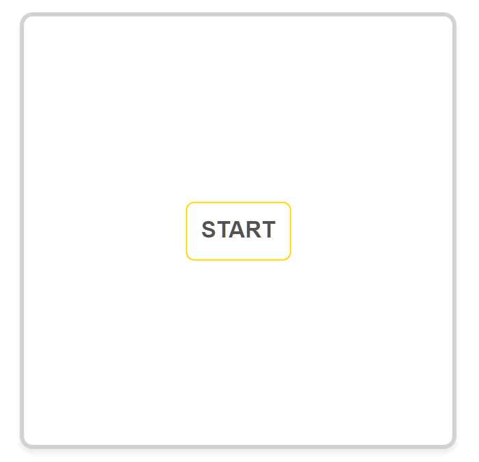
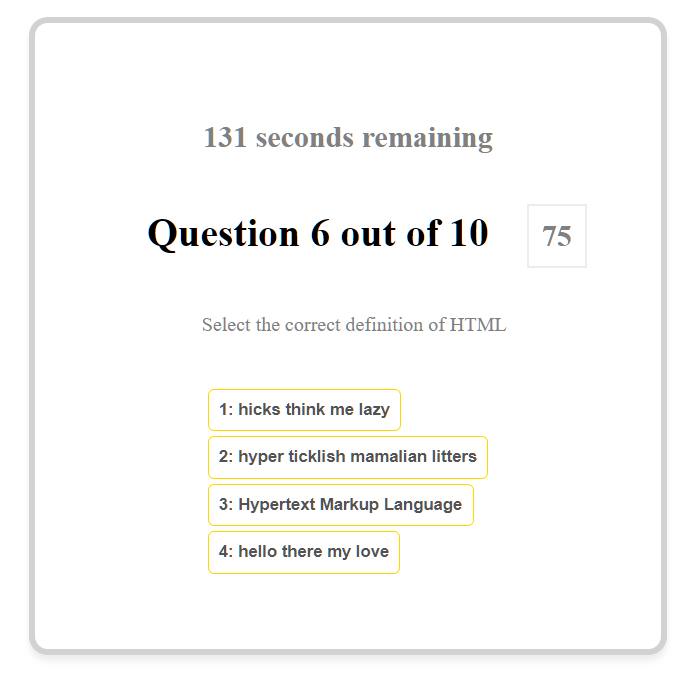
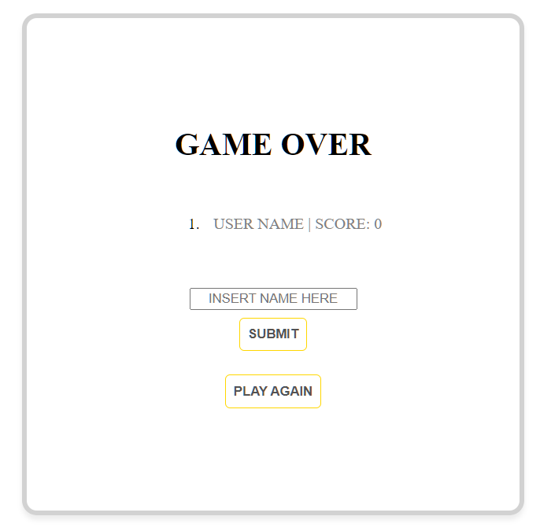

# Web Development Quiz Game | J. Ring-Sakabe

## In-Game Preview

## Project Description

In the spirit of making learning web development a fun and enjoyable process, this web application provides it's users with a functional quiz game which that be used to test one's basic knowledge of web development.  

* **Motivation** Having a background in foreign language education, this challenge was a critical learning opportunity for me where I could practice not only reviewing basic web development concepts, but also in applying that knowledge by performing tasks such as creating an array of various problems to be solved and use math methods to randomize the questions and solutions using JavaScript, HTML, and CSS so that each play of the game is unique and challenging.  

* **Solutions** This applications provides a fun solution for users who are seeking a means of testing their knowledge of simple concepts central to web development. 

* **Application** This project provided the opportunity to experience appending elements in javascript, storing objects locally on the browser, appending content to create a list, and so much more. 

## URL
Website: https://j-art-fox.github.io/coding-game/